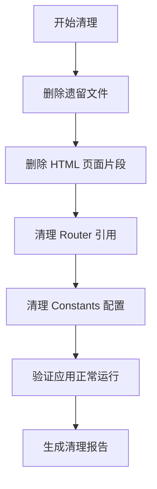

# Design Document

## Overview

本设计文档描述了如何系统性地清理项目中的冗余代码。清理工作分为四个主要部分：
1. 删除遗留的根目录文件
2. 删除 HTML 中未使用的页面片段
3. 清理 Router 中的无效引用
4. 清理常量配置中的无效条目

## Architecture

清理工作采用自底向上的方式进行：
1. 首先删除独立的遗留文件（不影响其他代码）
2. 然后删除 HTML 页面片段
3. 最后清理 JS 中的引用（Router 和 Constants）

## Components and Interfaces

### 1. 遗留文件清理

**目标文件：**
| 文件 | 行数 | 说明 |
|------|------|------|
| `app.js` | ~8600 | 旧版单文件前端逻辑，已被 js/ 目录模块化代码替代 |
| `app.js.backup` | ~8600 | app.js 的备份文件 |
| `style.css` | ~10600 | 旧版样式文件，已被 css/ 目录模块化样式替代 |
| `fix_css_indent.py` | ~20 | 一次性使用的 Python 脚本 |

**验证方法：**
- 确认 index.html 中 `<script src="/app.js">` 已被注释
- 确认 index.html 中没有 `<link href="/style.css">`
- 确认所有功能由 `js/app.js` 和 `css/*.css` 提供

### 2. HTML 页面片段清理

**目标片段：**

| 片段 ID | 位置 | 说明 |
|---------|------|------|
| `#importNextCard` | index.html ~2309行 | 占位页面，从未实际使用 |
| `#memberInfoCard` | index.html ~1727行 | 旧版账户信息页，已被跳过 |

**依赖分析：**
- `#importNextCard`: 仅在 router.js 的 allCardIds 数组中引用
- `#memberInfoCard`: 在 router.js 中有路由处理，但注释表明已废弃

### 3. Router 清理

**需要修改的文件：** `js/router.js`

**修改内容：**
1. 从 `allCardIds` 数组中移除：
   - `'finalCard'` - 不存在于 HTML
   - `'importNextCard'` - 将被删除
   - `'memberInfoCard'` - 将被删除

2. 删除路由 case：
   - `case '/member-info':` 及其处理逻辑
   - 删除 `handleMemberInfoRoute()` 函数

3. 删除相关导入（如有）

### 4. Constants 清理

**需要修改的文件：** `js/config/constants.js`

**修改内容：**
1. 从 `ROUTES` 常量中移除：
   - `MEMBER_INFO: '/member-info'`
   - `IMPORT_NEXT: '/import-next'`

2. 从 `ROUTE_CARD_MAP` 常量中移除：
   - `'/member-info': 'memberInfoCard'`
   - `'/import-next': 'importNextCard'`

## Data Models

不涉及数据模型变更，本次清理仅涉及代码删除。

## Correctness Properties

*A property is a characteristic or behavior that should hold true across all valid executions of a system-essentially, a formal statement about what the system should do. Properties serve as the bridge between human-readable specifications and machine-verifiable correctness guarantees.*

由于本次清理工作主要是删除操作，大部分验收标准是具体的示例验证而非通用属性。以下是可验证的正确性属性：

### Property 1: Application Functionality Preservation
*For any* user interaction that worked before the cleanup, the same interaction should produce the same result after the cleanup.
**Validates: Requirements 1.1, 1.3, 2.1, 2.2**

### Property 2: Route Consistency
*For any* route defined in ROUTES constant, there should be a corresponding entry in ROUTE_CARD_MAP and a valid HTML element with that card ID.
**Validates: Requirements 3.1, 4.1, 4.2**

## Error Handling

### 文件删除错误
- 如果文件不存在，跳过删除操作
- 如果文件被占用，提示用户关闭相关程序

### HTML 修改错误
- 在修改前备份 index.html
- 如果修改失败，恢复备份

### 验证错误
- 如果删除后应用无法正常运行，立即回滚所有更改

## Testing Strategy

### 手动验证步骤

1. **删除前准备**
   - 记录当前文件大小和行数
   - 确保应用正常运行

2. **删除后验证**
   - 启动开发服务器 `go run ./backend/cmd/webserver/main.go`
   - 访问所有主要页面：
     - `#/welcome` - 欢迎页
     - `#/login` - 登录页
     - `#/new` - 新建账户页
     - `#/entry` - 钱包管理页
     - `#/import` - 导入钱包页
     - `#/main` - 主钱包页
     - `#/join-group` - 加入担保组织页
     - `#/profile` - 个人信息页
     - `#/history` - 历史记录页
   - 确认所有页面正常显示
   - 确认所有交互功能正常

3. **回归测试**
   - 创建新账户流程
   - 登录流程
   - 导入钱包流程
   - 切换语言
   - 切换主题

### 验证清单

| 验证项 | 预期结果 |
|--------|----------|
| 删除 app.js 后应用正常 | ✓ |
| 删除 style.css 后样式正常 | ✓ |
| 删除 HTML 片段后路由正常 | ✓ |
| 所有页面可正常访问 | ✓ |
| 无 JavaScript 控制台错误 | ✓ |
