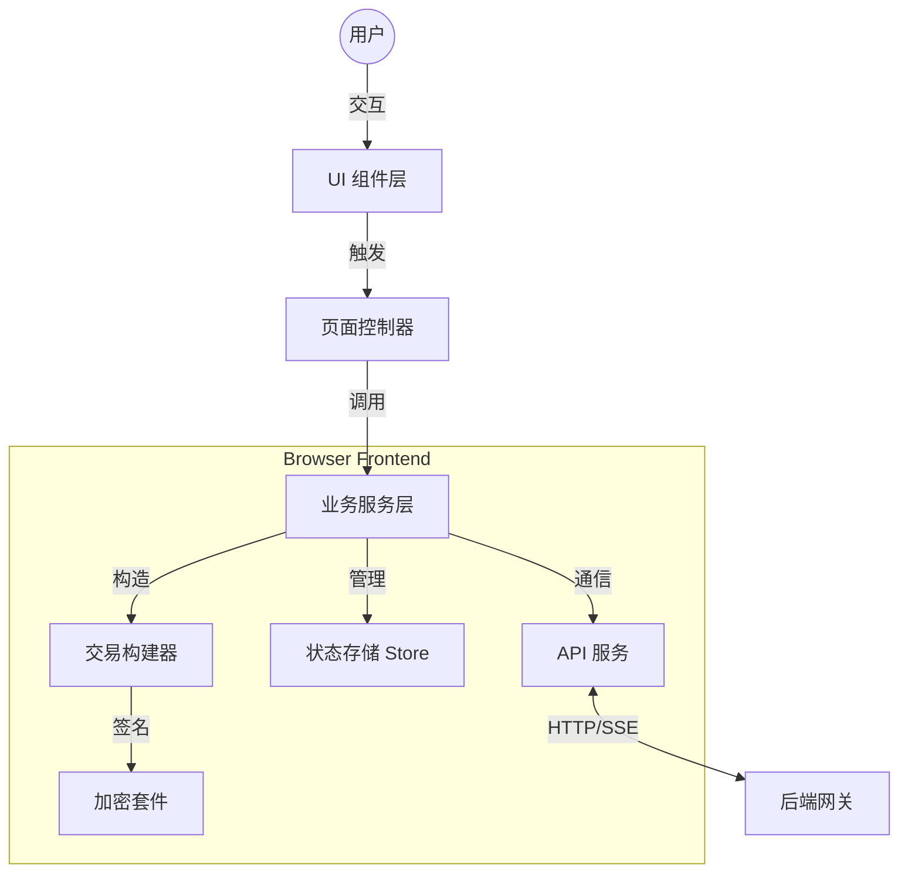

<div align="center">
  
  <h1>PanguPay Transfer Interface</h1>
  <h3>盘古系统 UTXO 转账前端界面</h3>
  
  <p>
    <a href="https://github.com/19231224lhr/TransferAreaInterface/issues"></a>
    <a href="https://github.com/19231224lhr/TransferAreaInterface/network/members"></a>
    <a href="https://github.com/19231224lhr/TransferAreaInterface/stargazers"></a>
    <a href="#"></a>
  </p>
  
  <p>
    <strong>面向盘古系统的纯前端 UTXO 钱包。</strong><br>
    安全、模块化、高性能，提供从账户管理到复杂交易构造的一站式体验。
  </p>
</div>

---

## 📑 目录

*   [📖 项目简介](#-项目简介)
*   [✨ 核心特性](#-核心特性)
*   [🏗 技术架构](#-技术架构)
*   [💻 技术栈](#-技术栈)
*   [🚀 快速开始](#-快速开始)
*   [📚 开发文档](#-开发文档)
*   [👨‍💻 核心开发者](#-核心开发者)
*   [⚖️ 版权协议](#-版权协议)

---

## 📖 项目简介

**PanguPay** 是专为盘古系统（Pangu System）设计的 Web 端钱包应用。不同于传统的账户模型钱包，PanguPay 在浏览器端完全实现了 **UTXO 状态管理**、**交易构造（Inputs/Outputs）** 以及 **P-256 离线签名**，通过安全的 API 与后端网关进行交互。

### 核心能力
*   **多模式转账**: 支持普通转账（AggregateGTX）、快速转账（UserNewTX）以及跨链桥接（Cross-Chain）。
*   **担保组织集成**: 无缝展示与加入担保组织，享受更低费率与更快确认速度。
*   **实时状态同步**: 基于 SSE (Server-Sent Events) 和轮询机制，实现秒级余额与交易状态更新。
*   **客户端安全**: 采用 PBKDF2 + AES-256-GCM 本地加密私钥，确保敏感数据永不触网。

---

## ✨ 核心特性

- **🔐 账户安全管理**
    - 支持私钥 (WIF) 导入与本地生成新账户。
    - 严格的本地会话加密与自动锁屏保护。

- **💸 强大的交易引擎**
    - **普通转账**: 面向散户，聚合签名，去中心化程度高。
    - **快速转账**: 面向组织成员，由分配节点加速确认。
    - **跨链桥接**: 安全且标准化的 ETH/BTC 资产映射协议。

- **📊 资产可视化看板**
    - 多资产投资组合视图 (PGC, BTC, ETH, USDT)。
    - 交互式图表展示资产变化趋势。
    - UTXO 级别的精细化地址管理。

---

## 🏗 技术架构

项目遵循 **分层架构 (Layered Architecture)** 设计，职责边界清晰。



### 技术亮点
*   **渲染层**: 使用 `lit-html`，无 Virtual DOM 开销，提供原生级的渲染性能与安全性。
*   **状态管理**: 集中式响应式 Store，支持按需持久化。
*   **加密算法**: `elliptic` (P-256) 实现 ECDSA 签名，严格对齐链上序列化标准。

---

## 💻 技术栈

| 类别 | 技术 | 用途 |
|----------|------------|---------|
| **Core** | TypeScript | 类型安全与工程化基础 |
| **Build** | Vite 5 | 极速 HMR 与生产环境优化构建 |
| **UI** | Lit-HTML | 轻量级 HTML 模板渲染 |
| **Crypto** | Elliptic |符合标准的 P-256 签名算法 |
| **Utils** | BigInt-JSON | 大整数精度无损处理 |
| **Style** | CSS Variables | 原生支持明暗主题 (Dark Mode) |

---

## 🚀 快速开始

### 环境要求
- Node.js (v18+)
- npm 或 yarn

### 启动项目

1.  **克隆仓库**
    ```bash
    git clone https://github.com/19231224lhr/TransferAreaInterface.git
    cd TransferAreaInterface
    ```

2.  **安装依赖**
    ```bash
    npm install
    ```

3.  **启动开发服**
    ```bash
    npm run dev
    ```
    访问 `http://localhost:3000` 即可预览。

### 生产构建

```bash
npm run build
```
构建产物将输出至 `dist/` 目录，可直接部署至 Nginx 或 CDN。

---

## 📚 开发文档

更多详细技术细节，请参阅 `docs/` 目录：

*   **[总览 (Overview)](docs/overview.md)**: 项目规模与核心指标。
*   **[架构详解 (Architecture)](docs/architecture.md)**: 深入了解数据流与模块交互。
*   **[开发者指南 (Developer Guide)](docs/developer-guide.md)**: 新手入门与代码规范。
*   **[交易机制 (Transactions)](docs/transactions.md)**: 三种交易模式的底层实现逻辑。
*   **[后端接口 (Backend Connection)](docs/frontend-backend-connection.md)**: API 协议与网关对接规范。

---

## 👨‍💻 核心开发者

<table>
  <tr>
    <td align="center" width="120">
      <a href="https://github.com/19231224lhr">
        
      </a>
      <br />
      <a href="https://github.com/19231224lhr"><strong>小孤独</strong></a>
    </td>
  </tr>
</table>

### 🦾 协作智能 (AI Collaborators)

本项目由人类开发者与 AI 协同构建。特别致谢以下工具与模型提供的卓越贡献：

| **AI IDE / Tools** | **LLM Models** | **Image Gen** |
| :--- | :--- | :--- |
|  <br>  <br>  <br>  <br>  <br>  |  <br>  <br>  <br>  <br>  |  |

---

## ⚖️ 版权协议

本项目为 **闭源软件 (Proprietary Software)**，受版权法保护。

**版权所有 © 2024-2026 Pangu System Team. 保留所有权利。**

严禁未经授权的复制、分发、修改或用于商业用途。
本项目代码仅供内部开发、测试与审计使用。任何超出授权范围的使用行为均视为侵权。
