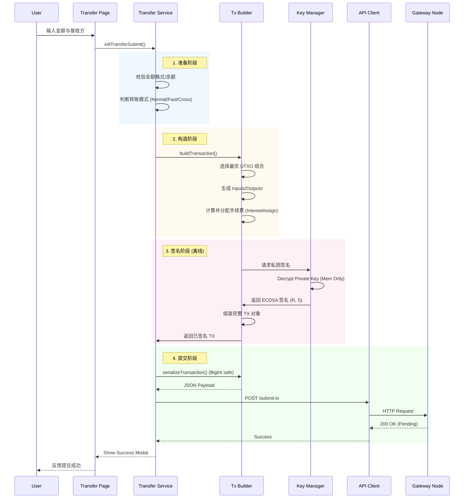

# 架构与技术细节 (Architecture & Technical Details)

## 1. 架构全景 (Architecture Overview)

本项目采用 **分层设计 (Layered Architecture)**，确保模块职责单一、边界清晰。整个应用完全运行在浏览器端，通过 HTTP/SSE 与 Gateway 进行安全的异步通信。

### 1.1 系统分层图

```mermaid
graph TD
    subgraph "Infrastructure Layer (基础设施层)"
        Utils[js/utils/*<br>安全/加密/持久化/格式化]
        Config[js/config/*<br>常量/模板配置/API]
        Core[js/core/*<br>事件委托/命名空间]
    end

    subgraph "Service Layer (业务服务层)"
        WalletSvc[Wallet Service<br>资产/UTXO管理]
        TxBuilder[Tx Builder<br>交易构造/签名]
        TransferSvc[Transfer Service<br>交易分流/提交]
        HistorySvc[History Service<br>记录管理]
        GroupSvc[Group Service<br>组织交互]
        Network[API Client<br>HTTP/轮询/SSE]
    end

    subgraph "Application Layer (应用层)"
        Router[Router<br>路由分发/页面加载]
        Pages[Pages<br>页面逻辑控制器]
        Store[Store<br>全局状态管理]
    end

    subgraph "Presentation Layer (表现层)"
        HTML[Templates<br>HTML 模板]
        UI[UI Components<br>Header/Modal/Charts]
        Renderer[Lit-HTML<br>渲染引擎]
    end

    %% 依赖关系
    Pages --> Router
    Pages --> Service Layer
    Service Layer --> Infrastructure Layer
    Router --> Renderer
    Renderer --> HTML
```

---

## 2. 核心数据流 (Core Data Flow)

### 2.1 交易完整生命周期 (Transaction Lifecycle)

从用户点击发送到交易上链，数据流经严格的流水线处理：



---

## 3. 安全架构详解 (Security Architecture)

作为一个自托管钱包，安全性是架构设计的基石。

### 3.1 密钥管理 (Key Management)
*   **存储加密**：私钥从未以明文形式存储在 `localStorage`。用户设置密码后，系统使用 **PBKDF2** 派生密钥，结合 **AES-256-GCM** 算法对私钥进行加密存储。
*   **内存保护**：明文私钥仅在用户“登录”期间存在于内存变量中，页面刷新或锁屏后立即清除。
*   **签名隔离**：签名逻辑封装在 `js/utils/signature.ts`，确保私钥只在签名函数闭包内短暂使用，不暴露给业务层。

### 3.2 序列化安全
*   **BigInt 精度**：所有涉及金额（int64）与公钥坐标（256位）的字段，传输时严禁使用标准 JSON number，必须序列化为 String 或特定结构，前端使用 `json-bigint` 库进行解析，杜绝精度丢失导致签名验证失败。
*   **字段序**：签名对象的序列化严格遵循 Golang 后端的结构体字段顺序，确保两端哈希一致。

---

## 4. 状态管理策略 (State Management)

项目采用 **"Single Store, Reactive Update"** 模式。

### 4.1 Store 设计
`js/utils/store.js` 维护全局单一状态树：
```typescript
interface State {
    user: { accountId, nickname, avatar... }, // 用户信息
    wallet: { balance, addresses, utxos... }, // 钱包资产
    config: { theme, language... },           // 全局配置
    ui: { showMenu, currentModal... }         // 瞬时 UI 状态
}
```

### 4.2 持久化 (Persistence)
*   **按需持久化**：并非所有状态都写入磁盘。只有 `user` (加密信息) 和 `config` 被持久化。`wallet` 状态每次启动时重新拉取，确保数据新鲜。
*   **防抖写入**：状态变更触发的写入操作经过 Debounce 处理，减少 IO 开销。

---

## 5. 性能优化 (Performance)

1.  **模板懒加载**：HTML 模板文件（如 `wallet.html`）仅在路由首次命中时通过 fetch 加载并缓存，大幅减小首屏体积。
2.  **批量渲染**：数据变动频繁（如 SSE 推送）时，使用 `requestAnimationFrame` 聚合多次 UI 更新请求，避免布局抖动 (Layout Thrashing)。
3.  **Service Worker**：预缓存核心 JS/CSS 资源，实现“离线可访问”骨架屏，提升弱网体验。

---

## 6. 总结
本架构在保持代码轻量化的同时，实现了企业级的安全标准与扩展性。明确的分层与单向数据流使得调试与维护变得简单可控。
