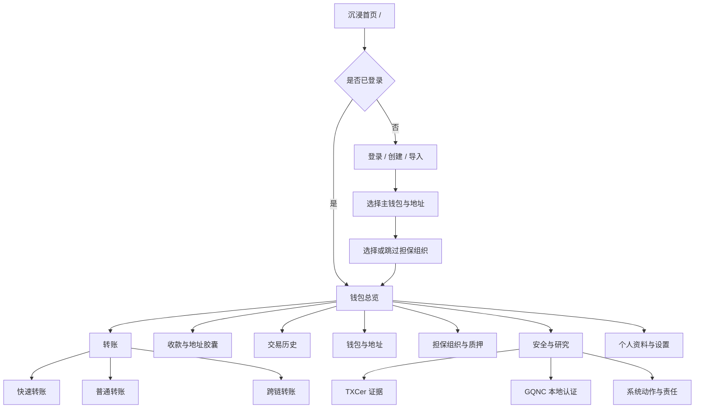

# PanguPay Next Web 最终设计方案

> 状态：设计定稿
>
> 日期：2026-07-24
>
> 适用范围：全新的响应式 Web 前端，不包含浏览器插件
>
> 工作名称：`PanguPay-Web`（仓库正式命名可在创建时调整）

## 1. 最终结论

新前端不在旧 `TransferAreaInterface` 上继续叠加样式，而是建立一个独立 Git 仓库，从零实现。

整体产品由两个明确分离、但视觉连续的空间组成：

```text
黑曜 / 珍珠入口
    无传统导航栏
    负责品牌、第一印象和快速入口
            ↓
身份验证与钱包选择
            ↓
流动账本
    负责转账、收款、地址、组织、历史和安全状态
            ↓
安全透镜
    按需解释 TXCer、GQNC、责任和审计信息
```

设计的核心不是把区块链字段全部铺到页面上，而是同时做到：

1. 普通用户三步以内完成日常转账。
2. TXCer 的“快速可用”成为最明显的产品优势。
3. GQNC、FastEvidence、CFAA 和责任份额有准确但不过度打扰的展示。
4. 研究人员能够继续展开查看协议证据和性能数据。
5. 桌面横屏、平板和手机竖屏都使用同一套信息架构。

## 2. 产品原则

### 2.1 钱包优先，研究展示不抢主任务

默认层只回答四个问题：

- 我有多少钱？
- 现在能否支付？
- 钱转给谁、转多少？
- 这笔交易到了哪一步？

协议术语放在“安全透镜”中逐层展开。普通用户先看到“可支付、已认证、审计中”，研究人员再展开看到 TXCerID、QCID、ExposureShares 和 Merkle proof。

### 2.2 首页负责震撼，钱包负责耐用

- 首页允许更强的光影、轨道和空间感。
- 登录后的主应用降低装饰强度，强调精确、安静、连续使用不疲劳。
- 两处使用同一组颜色、圆角、文字和运动曲线，避免像两个产品。

### 2.3 状态必须诚实

页面统一使用以下状态链：

```text
交易已提交
→ TXCer 已可支付
→ GQNC 本地认证完成
→ 上层锚定状态
```

其中：

- `TXCer 已可支付` 不等于区块已认证。
- `LOCAL_CERTIFIED` 不冒充系统级最终性。
- `AssumedAccepted` 必须显示为“实验环境默认接受”，不能显示为“全局最终确认”。
- CFAA 处于 `Pending` 或 `Unavailable` 时不阻塞 TXCer 可支付。
- FastEvidence 明确失败时，TXCer 必须进入隔离状态。

### 2.4 渐进披露

每个页面只在用户需要时增加复杂度：

```text
摘要
→ 状态解释
→ 协议证据
→ 原始字段
```

Gas、找零地址、担保组织 ID、公钥、责任根等字段默认折叠在“高级选项”中。

## 3. 技术架构决策

### 3.1 推荐技术栈

采用单一 Vue Web 应用：

- Vue 3 + TypeScript。
- Vite。
- Vue Router。
- Pinia。
- Vue I18n。
- Vitest + Vue Test Utils。
- Playwright 用于真实浏览器点击验收。
- CSS Variables + CSS Layers + Vue SFC 样式。

不建议：

- 在第一版建立 monorepo。
- 引入 Three.js 只为首页轨道动画。
- 复制旧项目的 DOM 操作式页面架构。
- 迁移旧项目全部 CSS。
- 同时维护两套协议 DTO。

首页动态轨道使用 SVG、CSS 和 Web Animations API 即可达到需要的视觉效果，同时更容易适配移动端、明暗主题和 `prefers-reduced-motion`。

### 3.2 代码目录

```text
src/
  app/
    App.vue
    bootstrap/
  router/
  layouts/
    PublicPortalLayout.vue
    AuthLayout.vue
    LedgerLayout.vue
  pages/
    public/
    auth/
    wallet/
    research/
  features/
    account/
    transfer/
    receive/
    address/
    organization/
    txcer/
    gqnc/
    activity/
  entities/
    transaction/
    wallet/
    txcer/
    organization/
  shared/
    api/
    protocol-v2/
    keystore/
    ui/
    motion/
    i18n/
    testing/
  stores/
  styles/
    tokens.css
    themes.css
    reset.css
    typography.css
```

### 3.3 必须直接复用的旧项目资产

新仓库只迁移经过验证的领域实现：

- `protocol-v2` 规范化、精确金额与 64 位十六进制 TXID。
- Go golden vectors。
- TXCer、ExposureShares、FastEvidence、AssignAck、LiabilityReceipt、CFAA proof DTO 与验签逻辑。
- 地址注册规范签名材料。
- API method/path 契约。

不直接迁移：

- 旧 HTML 页面。
- 旧路由和页面加载器。
- 手写 DOM 事件绑定。
- 旧 CSS 文件和旧布局。
- 旧页面中的重复类型定义。

### 3.4 状态划分

Pinia store 按领域拆分：

```text
sessionStore
    登录、锁定、当前账户

walletStore
    钱包、地址、UTXO、余额

txCerStore
    TXCer、生命周期、证据与隔离状态

transferStore
    转账草稿、选币、提交和进度

organizationStore
    当前担保组织、候选组织、质押信息

networkStore
    Gateway、Assign、ComNode 发现和健康状态

settingsStore
    主题、语言、性能模式、自动锁定
```

金额的持久化表示始终为规范十进制字符串；计算与比较使用 `bigint`。页面显示值不能回流到签名和交易构造。

## 4. 信息架构



### 4.1 唯一待确认的业务契约

旧 Web 的显式页签是：

```text
quick / cross / pledge
```

代码中没有独立的 `normal` 页签；无担保组织用户则通过普通无组织交易接口提交。

因此新界面的处理原则为：

- 快速转账：明确映射当前 `quick`，默认优先 TXCer。
- 跨链转账：明确映射当前 `cross`，不使用 TXCer。
- 质押：从日常转账页移到“担保组织与质押”。
- 普通转账：
  - 无担保组织账户可自动显示并映射现有无组织交易路径；
  - 已加入组织的账户是否允许手动选择“UTXO-only 普通转账”，必须在编码前核对后端契约；
  - 未确认前不伪造一个新的 wire 模式。

这不阻塞视觉和组件开发，只阻塞该模式的最终提交适配器。

## 5. 沉浸首页：黑曜 / 珍珠入口

### 5.1 页面目标

首页是一张完整的“系统入口”，不是传统营销网站：

- 不设置顶部导航栏。
- 首屏不堆叠功能卡片。
- 不依赖向下滚动理解产品。
- 只留下品牌、核心价值、动态视觉和少量入口。

### 5.2 桌面布局

```text
┌──────────────────────────────────────────────────────────────┐
│  PanguPay                                      ◐  中文/EN   │
│                                                              │
│  价值，在确认之前流动。                  ┌───────────────┐   │
│  Spend now. Settle with certainty.       │   动态价值轨道  │   │
│                                           │  ◯  ◌  ◯  ◌  │   │
│  [进入钱包] [创建钱包] [导入钱包]         │ TXCer → GQNC  │   │
│                                           └───────────────┘   │
│  查看工作原理  ·  实验网络状态                                 │
└──────────────────────────────────────────────────────────────┘
```

左上角品牌和右上角主题/语言属于轻量工具，不构成导航栏。

### 5.3 动态价值轨道

首页主视觉不是固定性能数字，而是抽象的“价值流动装置”：

- 三条不同速度的轨道。
- 四个具有明确语义的节点：
  - Wallet signed
  - TXCer spend-ready
  - FastEvidence verified
  - 3-of-4 BlockQC
- 轨道之间偶尔出现一条柔和的价值脉冲。
- 鼠标移动只产生轻微视差，不追逐鼠标。
- 指针悬停节点时显示一句人类语言解释。
- 登录成功后，中心标记从品牌符号过渡为当前钱包头像。

暗色主题使用黑曜石背景和冷蓝光；亮色主题使用珍珠白背景、浅银轨道和低饱和蓝光。亮色不是简单颜色反转。

### 5.4 首页按钮规则

未登录：

- 主按钮：`登录钱包`
- 次按钮：`创建钱包`
- 文本按钮：`导入钱包`
- 低强调入口：`查看工作原理`

已登录：

- 主按钮：`进入钱包`
- 次按钮：`快速转账`
- 文本按钮：`切换账户`

点击需要身份的入口但用户未登录时，进入统一身份选择页，不能弹出零散登录对话框。

### 5.5 手机竖屏

- 动态轨道位于上半屏，直径约为视口宽度的 82%。
- 主标题和按钮位于下半屏。
- 主按钮固定为全宽，次按钮并排或纵向排列。
- 使用安全区内边距。
- 光影强度下降，轨道节点数不变。

## 6. 身份与首次使用流程

统一为一个清晰的身份网关：

```text
登录已有钱包
创建新钱包
导入钱包
```

### 6.1 创建钱包

```text
创建身份
→ 展示并确认备份材料
→ 设置本地密码
→ 创建首个地址
→ 选择担保组织或暂时跳过
→ 进入钱包
```

关键设计：

- 备份信息不能只靠一次“复制成功”提示。
- 私钥与种子材料默认遮蔽。
- 每一步只有一个主动作。
- 离开敏感步骤前明确确认已经备份。

### 6.2 导入钱包

支持旧 Web 已有的：

- 主账户材料导入。
- 子钱包 / 地址 RootSeed 导入。
- 自动检测已有组织关系。
- 导入成功后显示恢复到的钱包、地址和组织摘要，再进入应用。

### 6.3 登录与自动锁定

- 登录页只要求必要凭据。
- 密码可见切换使用按下显示或短时显示。
- 自动锁定画面使用同一黑曜/珍珠视觉，不跳回营销首页。
- 解锁后回到锁定前页面和草稿。

## 7. 登录后主应用：“流动账本”

### 7.1 桌面结构

```text
┌──────────────┬────────────────────────────────────┬───────────┐
│ 头像 / 账户   │ 页面标题、关键余额、主要操作         │ 安全透镜   │
│              │                                    │ 按需出现   │
│ 总览          │                                    │           │
│ 转账          │          当前页面内容               │ 状态解释   │
│ 收款          │                                    │ 协议证据   │
│ 钱包与地址    │                                    │ 原始字段   │
│ 交易历史      │                                    │           │
│ 担保组织      │                                    │           │
│ 安全与研究    │                                    │           │
│              │                                    │           │
│ 设置 / 锁定   │                                    │           │
└──────────────┴────────────────────────────────────┴───────────┘
```

- 左侧栏展开宽度约 232px，收起后约 80px。
- 头像、账户切换和组织状态固定在左上。
- 主操作区域不使用密集仪表盘网格。
- 安全透镜不是常驻第三栏，只在交易详情、TXCer 和研究页按需打开。

### 7.2 手机结构

底部导航固定为：

```text
总览   转账   收款   历史   我的
```

- “转账”可作为中间强调动作，但不做夸张悬浮按钮。
- 组织、钱包地址、安全研究和设置进入“我的”二级菜单。
- 所有桌面侧栏内容在手机上转换为底部 Sheet 或独立页面。
- 表格转换为信息卡列表，不能横向缩放整张桌面表格。

## 8. 核心页面设计

### 8.1 钱包总览

首屏内容：

- 可支付总额。
- PGC、BTC、ETH 分资产余额。
- `转账`、`收款`、`创建地址` 三个快速动作。
- 当前担保组织摘要。
- 最近三笔交易。
- 一条简洁的系统状态带。

余额区明确区分：

```text
可支付余额
    UTXO + 当前可消费 TXCer

后台结算中
    已经可支付、但尚未完成 GQNC 本地认证的价值

隔离
    FastEvidence 验证失败或证据冲突的 TXCer
```

不再使用容易误解的“TXCer（待转换）”，统一改为“TXCer 可支付余额”。

### 8.2 转账

页面采用两阶段构造：

```text
填写
→ 确认
→ 提交与状态
```

模式选择使用大号分段控件：

- `快速转账`
- `普通转账`（按第 4.1 节契约启用）
- `跨链转账`

快速转账默认：

- 优先使用 TXCer。
- 展示预计使用的普通 UTXO 与 TXCer 比例。
- 支持多收款人。
- 支持 PGC、BTC、ETH。
- 高级设置中提供来源地址、Gas、找零地址和担保组织信息。

跨链转账：

- 自动隐藏 TXCer、公钥、担保组织 ID 和不适用的 Gas 字段。
- 明确显示“跨链不使用 TXCer 快速路径”。

确认页：

- 收款人、资产、金额、Gas、来源和模式。
- 精确显示 64-hex TXID 的生成状态，但完整 ID 放在可展开区域。
- 按钮文案为 `确认并签名`，不能模糊为 `下一步`。

提交后展示双时间线：

```text
可用性
    已提交 → TXCer 已可支付

结算
    待打包 → GQNC Proposal → 3-of-4 BlockQC → 本地认证
```

这样用户能直接理解“钱已经能花”和“后台仍在结算”可以同时成立。

### 8.3 收款与一次性地址胶囊

两个页签：

- `常用地址`
- `一次性地址胶囊`

常用地址：

- 地址、二维码、资产、可选金额和备注。
- 复制、分享、切换地址。

一次性地址胶囊：

- 从当前真实地址生成。
- 显示所属担保组织或委员会来源。
- 显示签名验证状态。
- 复制、二维码、重新生成和验证。
- 使用人类语言说明其隐私目的和一次性语义。

高级详情可展示：

- 组织 ID。
- 胶囊签名。
- 解析与验证结果。

### 8.4 钱包与地址

使用层级树展示：

```text
主钱包
  ├─ 子钱包 A
  │   ├─ 地址 1
  │   └─ 地址 2
  └─ 子钱包 B
```

支持旧 Web 能力：

- 创建子钱包。
- 导入子钱包。
- 创建地址。
- 导入地址。
- 解锁。
- 复制恢复材料。
- 删除本地子钱包。
- 从组织解绑地址。

危险动作使用明确的二次确认，确认框中显示影响对象，不要求用户仅凭地址尾号猜测。

### 8.5 交易历史

筛选维度：

- 全部 / 今天 / 本周 / 本月。
- 快速 / 普通 / 跨链 / 质押 / 强制兑换 / 赔付。
- PGC / BTC / ETH。
- 可支付 / 本地认证 / 审计异常 / 失败。

详情页分三层：

1. 金额、对方、时间、模式。
2. 交易状态时间线。
3. 原始证据与完整 ID。

### 8.6 担保组织与质押

普通用户区：

- 当前组织。
- 推荐组织。
- 搜索组织。
- 加入、退出和切换。
- 组织公钥与节点端点放在高级信息。

质押独立成为该模块中的操作，不与日常转账模式并列。

角色受控区：

- 组织申请。
- Committee 申请与退出。
- Governance action 状态。
- 责任信用线和根敞口。

未具备角色时不显示空白控制台。

### 8.7 安全与研究

分为两个视角：

#### 用户安全

- 当前 TXCer 是否可支付。
- FastEvidence 是否验证。
- CFAA 是否完成审计。
- ExposureShares 摘要。
- GQNC 是否本地认证。
- 上层锚定是否真实完成。

#### 研究观察

- GQNC certified height。
- 当前 validator set。
- 最新 BlockQC、NAC 和 safety 状态。
- TXCer、交易池、GQNC 和 settlement 性能指标。
- SystemAction：Governance、Liability、Redemption、ForcedExchange、Compensation。

普通钱包只调用查询接口，不暴露原始注入、攻击或运维写入接口。

## 9. 视觉设计系统

设计名称：

> **Obsidian / Pearl — Living Orbit**
>
> 黑曜 / 珍珠 · 流动轨道

### 9.1 色彩

```css
/* Dark */
--bg:             #08080A;
--surface-1:      #101013;
--surface-2:      #151518;
--text-1:         #F5F5F7;
--text-2:         #A1A1A8;
--line:           rgba(255,255,255,.10);
--accent:         #2997FF;
--success:        #45BD72;
--warning:        #F0A34A;
--danger:         #FF6B65;

/* Light */
--bg:             #F2F3F5;
--surface-1:      #FFFFFF;
--surface-2:      #F7F7F9;
--text-1:         #1D1D1F;
--text-2:         #68686F;
--line:           rgba(0,0,0,.09);
--accent:         #0071E3;
--success:        #248A4B;
--warning:        #A45600;
--danger:         #CF4039;
```

规则：

- 不使用彩虹渐变。
- 不把每一块内容都做成悬浮玻璃卡片。
- 蓝色只表示主动作和活跃状态。
- 绿色只表示成功或已验证。
- 橙色表示实验、待审计或需注意。
- 红色只用于真实错误和危险动作。

### 9.2 字体

- 英文与数字：SF Pro / Inter。
- 中文：PingFang SC / 系统无衬线。
- TXID、QCID、地址：等宽字体。
- 大余额使用 tabular numbers。
- 正文不使用极细字重。

### 9.3 空间与形状

- 基础间距单位：4px。
- 常用间距：8 / 12 / 16 / 24 / 32 / 48。
- 圆角：11 / 17 / 24 / 30。
- 输入控件高度：48px。
- 桌面主按钮高度：48px。
- 移动触控目标不小于 44px。
- 阴影只用于弹层和首页主视觉，不用于所有容器。

## 10. 动效规范

### 10.1 基础时间

- 按钮反馈：160–200ms。
- 小型展开：200–260ms。
- 页面和 Sheet：260–360ms。
- 主题切换：220–280ms。
- 首页轨道：18–30s 持续一圈。

### 10.2 运动原则

- 动画必须可以被中断。
- 页面切换不使用长队列式 stagger。
- 控件按下缩放约 `0.97`，释放后弹回。
- Sheet 和弹窗使用物理感弹簧，不使用机械匀速。
- 成功动效表达价值从发送者流向接收者，然后分出后台结算支线。
- `prefers-reduced-motion` 下停止轨道旋转，仅保留淡入和状态变化。

### 10.3 性能分级

设置中保留：

- 自动。
- 流畅。
- 节能。
- 减少动态效果。

低性能设备降低光影模糊和粒子数量，但不删除关键信息。

## 11. 响应式规则

不只按“桌面 / 手机”切换，而是按可用空间改变布局：

```text
Compact    < 768px
Medium     768–1199px
Wide       >= 1200px
```

- Compact：底部导航、单列、Bottom Sheet。
- Medium：紧凑侧栏，横屏时允许双列。
- Wide：完整侧栏和按需安全透镜。
- 使用 Container Queries 管理组件内部布局。
- 适配 `safe-area-inset-*`。
- 中文和英文都预留至少 30% 的文字宽度弹性。

## 12. 主题与国际化

### 12.1 主题

支持：

- 跟随系统。
- 珍珠亮色。
- 黑曜暗色。

未登录时保存全局主题；登录后允许账户级覆盖。首页、登录页和主应用必须同步切换，不能出现白屏闪烁。

### 12.2 中英文

- 从第一天使用 i18n key。
- 不在模板中拼接中英文句子。
- 金额和日期使用 `Intl`。
- 协议 ID 不本地化。
- 每个中文安全术语提供一句可展开解释。

## 13. API 与后端能力映射

新 Web 继续使用现有后端能力，不要求先扩张 API：

### 启动与发现

- `GET /api/v1/groups`
- `GET /api/v1/groups/{id}`
- `GET /api/v1/committee/endpoint`
- `GET /api/v1/com/health`

### 地址与账户

- 地址查询、地址组织查询、散户注册地址。
- Assign 新地址、解绑地址。
- 账户更新和账户更新流。

### 交易与 TXCer

- Assign 提交交易。
- 无担保组织普通交易。
- 交易状态。
- TXCer 生命周期和跨组织接收。
- issuance record/detail/batch。
- Certifier 权威公钥。

### 组织

- 组织信息。
- 加入/退出申请。

### GQNC 与系统动作

- 只在“安全与研究”或角色受控页面使用查询接口。
- 普通钱包不调用旧 `/committee/qc/*`。
- 不暴露 DEV 攻击和原始责任注入接口。

若实现过程中发现“按 TXID 查询本地认证状态”仍缺少稳定响应，再单独提出最小后端契约；客户端不得自行推断 QC。

## 14. 可访问性与真实点击测试

从第一天规定：

- 每个交互控件有可访问名称。
- 键盘可完成全部主流程。
- 焦点样式不可删除。
- 状态不能只靠颜色表达。
- 动态更新使用合适的 live region。
- 所有关键控件设置稳定 `data-testid`。

真实 E2E 必须从首页开始点击：

```text
首页
→ 登录
→ 选择钱包
→ 进入总览
→ 打开转账
→ 选择模式
→ 输入收款人、币种和金额
→ 确认签名
→ 观察 TXCer 可支付
→ 观察 GQNC 本地认证
```

测试禁止：

- 直接调用 `buildTransaction()`。
- 直接调用 `submitTransaction()`。
- 写 LocalStorage 代替页面操作。
- 通过坐标点击没有稳定语义的元素。

环境准备可以使用 fixture；所有业务动作必须通过真实页面点击、输入和可见结果判断。

## 15. 新仓库实施阶段

### Phase 0：仓库与协议基线

- 创建独立仓库。
- 建立 Vue、TypeScript、路由、状态、i18n 和测试。
- 迁移 `protocol-v2` 与 golden vectors。
- 建立主题 Token 和组件基础。
- 建立后端路由契约检查。

### Phase 1：首页与身份

- 黑曜 / 珍珠首页。
- 动态价值轨道。
- 登录、创建、导入和钱包选择。
- 明暗主题、中英文和移动端。

### Phase 2：流动账本骨架

- 桌面侧栏和移动底栏。
- 钱包总览。
- 个人资料、主题、语言、自动锁定。
- Gateway / Committee / Assign 节点发现。

### Phase 3：钱包主功能

- 快速转账。
- 普通转账契约适配。
- 跨链转账。
- 收款和地址胶囊。
- 钱包与地址管理。
- 交易历史。

### Phase 4：组织与安全

- 组织推荐、搜索、加入和退出。
- 质押与角色受控入口。
- TXCer 证据和安全透镜。
- GQNC 与系统动作研究页。

### Phase 5：真实闭环和打磨

- Web A→B。
- Bob 获得 Active TXCer。
- 浏览器重启后重新验签。
- Bob 使用纯 TXCer 再支付。
- 混合 UTXO+TXCer。
- multi-root。
- 亮色、暗色、中文、英文、横屏和竖屏。
- 性能、无障碍和减少动态效果验收。

## 16. 最终验收标准

新前端只有同时满足以下条件才算完成：

- 首页没有传统导航栏，并达到黑曜/珍珠动态视觉目标。
- 未登录入口与已登录入口行为准确。
- 桌面侧栏和手机底部导航使用同一信息架构。
- 快速、普通、跨链、质押、币种、地址胶囊和组织能力均有准确入口。
- 协议金额、TXID 和证据验证与 Go production vectors 一致。
- TXCer 可支付与 GQNC 后台认证被清楚区分。
- 普通用户不需要理解协议术语也能完成转账。
- 研究人员可以逐层展开完整安全证据。
- 明暗主题、中英文和移动端不是后补功能。
- 所有核心流程通过真实浏览器点击完成。
- 不调用旧 AreaQC 接口，不把 `AssumedAccepted` 冒充全局最终性。

## 17. 设计定稿

最终采用：

```text
公开入口：
    黑曜 / 珍珠 · 动态价值轨道
    无导航、单屏、少量明确入口

身份空间：
    登录 / 创建 / 导入 / 钱包与组织选择

钱包主体：
    流动账本
    左侧栏 + 主画布 + 按需安全透镜

移动端：
    单列页面 + 底部导航 + Bottom Sheet

研究展示：
    不干扰支付，但可展开至 TXCer、GQNC、责任和审计证据
```

这套设计既保留“黑曜保险库”的震撼入口，也让日常钱包长期保持安静、精确和高效。它不是旧前端的换皮，而是围绕最新版 TXCer 与 GQNC 语义重新组织的一套完整 Web 产品。
